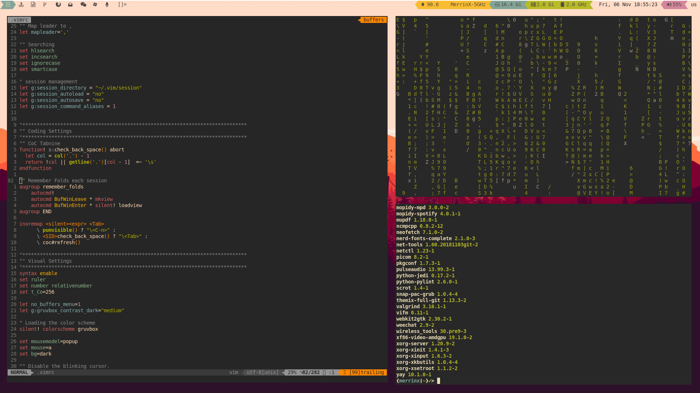

My DWM config
==============

# Setting up DWM 
Please read docs found [here](https://github.com/Gako358/Suckless/tree/1db702730bbd31b4871af87debef31389f22626e/dwm)

Sudo make install dmenu, dwm, dwmblocks, st and surf to get my setup!

## For my vim setup

Please download and run my vimrc file found [here](https://github.com/Gako358/Dotfiles/blob/c29bff846896715ed28f6658a3c4aa086f3bf083/.vimrc)

### Other setting are found [here](https://github.com/Gako358/Dotfiles/tree/c29bff846896715ed28f6658a3c4aa086f3bf083)

[0]: https://github.com/Gako358/Dotfiles/blob/c29bff846896715ed28f6658a3c4aa086f3bf083/.vimrc
[1]: https://github.com/Gako358/Dotfiles/tree/c29bff846896715ed28f6658a3c4aa086f3bf083
